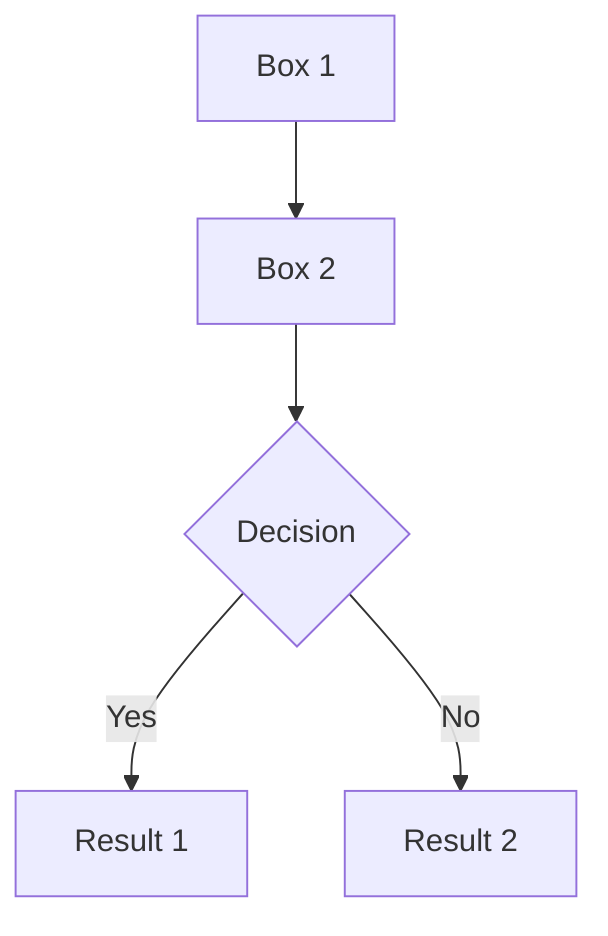
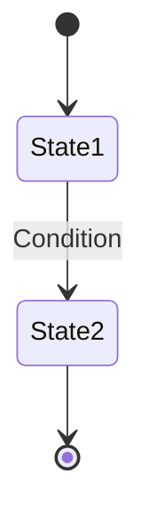
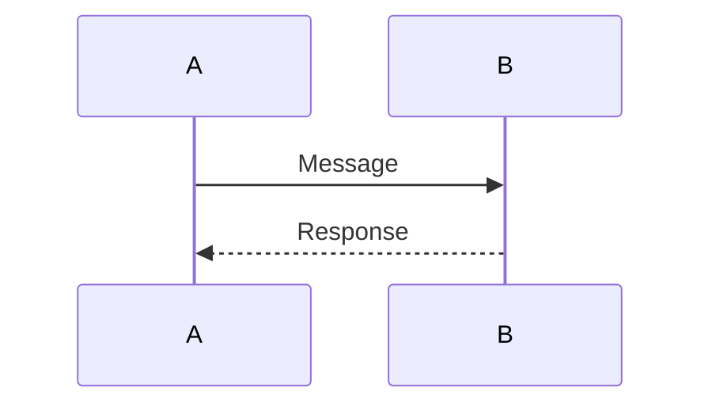

# 설계 문서 - Mermaid 다이어그램 추가

## 개요
calculator-prototype의 design.md를 Mermaid 다이어그램으로 개선합니다. 텍스트와 ASCII 아트로만 표현된 아키텍처를 전문적이고 명확한 다이어그램으로 시각화합니다.

## 다이어그램 추가 전략

### 1. Mermaid Flowchart - 시스템 아키텍처
**목적**: 전체 시스템의 데이터 흐름과 컴포넌트 간 관계 시각화

**배치**:
- design.md의 "아키텍처 개요" → "시스템 구성" 섹션 내
- 기존 ASCII 다이어그램 대체

**구성 요소**:
```
HTML UI (index.html)
    ↓ (Button Click)
Event Listeners (main.js)
    ↓ (State Update)
State Manager
    ↓ (Calculate Request)
Calculator Engine (calculator.js)
    ↓ (Result)
Display Update (DOM)
    ↓
User Display (Browser)
```

**Mermaid 문법**: Flowchart (graph TD)
- 노드: 각 컴포넌트/기능
- 엣지: 데이터/제어 흐름
- 레이블: 상호작용 설명

### 2. Mermaid State Diagram - 상태 머신
**목적**: 계산기의 모든 상태와 상태 전이를 명확히 표현

**배치**:
- design.md의 "상태 관리 설계" → "상태 전이" 섹션 내
- 기존 숫자 리스트 대체/보완

**상태 정의**:
1. **Initial**: 초기 상태 또는 초기화 후 상태
2. **WaitingOperand**: 첫 번째 피연산자 또는 두 번째 피연산자 입력 중
3. **WaitingOperator**: 연산자 입력 대기
4. **Calculate**: 계산 수행 후 결과 반영 상태

**전이 조건**:
- `숫자 버튼`: WaitingOperand 상태로 전이
- `소수점`: 현재 상태에서 소수점 추가
- `연산자`: WaitingOperator 상태로 전이
- `=`: Calculate 상태로 전이 후 Initial로 복귀
- `C`: 언제든 Initial로 복귀

### 3. Mermaid Sequence Diagram - 이벤트 처리
**목적**: 사용자 입력부터 화면 업데이트까지의 상호작용 시각화

**배치**:
- design.md의 "이벤트 처리 설계" 섹션 내
- 세 가지 주요 시나리오별 다이어그램

**시나리오 1: 숫자 입력**
```
User → HTML Button → main.js → State Update → DOM Display → User Display
```

**시나리오 2: 계산 수행**
```
User → HTML Button → main.js → calculator.js → State Update → DOM Display → User Display
```

**시나리오 3: 초기화**
```
User → HTML Button (C) → main.js → State Reset → DOM Display (0) → User Display
```

### 4. Mermaid Flowchart - 계산 데이터 흐름
**목적**: 입력값에서 최종 결과까지의 데이터 변환 과정

**배치**:
- design.md의 "계산 로직 설계" 섹션에 새로 추가
- 선택사항: 현재 텍스트 설명만으로도 충분하면 생략 가능

**데이터 변환 단계**:
1. 입력값 수신 (User Input)
2. 문자열 파싱 (Parse)
3. 타입 변환 (Conversion to Number)
4. 유효성 검사 (Validation)
5. 계산 로직 실행 (Calculation)
6. 결과 반환 (Return Result)
7. 디스플레이 표시 (Display)

## 구현 가이드

### Mermaid 지원 확인
- GitHub: ✅ 완전 지원
- GitLab: ✅ 완전 지원
- Notion: ✅ 지원 (일부 제한)
- 로컬 마크다운 뷰어: 브라우저 확장 필요 (예: Mermaid 플러그인)

### 문법 주의사항

#### 1. Flowchart


#### 2. State Diagram


#### 3. Sequence Diagram


### 가독성 최적화
- 노드 개수: 5-12개 범위 유지 (너무 많으면 세분화)
- 텍스트 길이: 노드당 최대 30글자
- 색상: Mermaid 기본 색상 사용 (명확성 우선)
- 레이블: 간결하고 명확한 동작/상태명

## 검증 절차

### 1. 문법 검증
- Mermaid Live Editor에서 테스트 (https://mermaid.live)
- 모든 다이어그램이 에러 없이 렌더링되는지 확인

### 2. 정확성 검증
- 다이어그램과 텍스트 설명 일치 확인
- calculator-prototype 구현과 일치하는지 검토

### 3. 가독성 검증
- 다이어그램 복잡도 적절성 확인
- 노드/레이블 명확성 검토
- 전체 페이지 레이아웃에서 균형 확인

## 향후 확장

### 계산 이력 기능 추가 시
- State Diagram에 History 관련 상태 추가
- Sequence Diagram에 이력 저장/조회 흐름 추가
- 새로운 데이터 흐름 다이어그램 추가 가능

### 테마/설정 기능 추가 시
- 새로운 Settings 모듈 컴포넌트 추가
- 전체 아키텍처 다이어그램 확장
- 설정 적용 흐름 다이어그램 추가

## 참고 문헌
- Mermaid 공식 문서: https://mermaid.js.org
- Mermaid Live Editor: https://mermaid.live
- GitHub에서 Mermaid 사용: https://docs.github.com/en/get-started/writing-on-github/working-with-advanced-formatting/creating-diagrams
