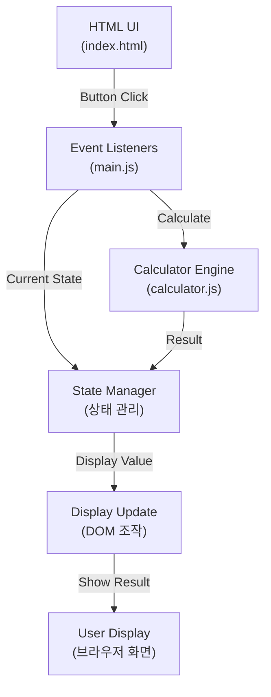
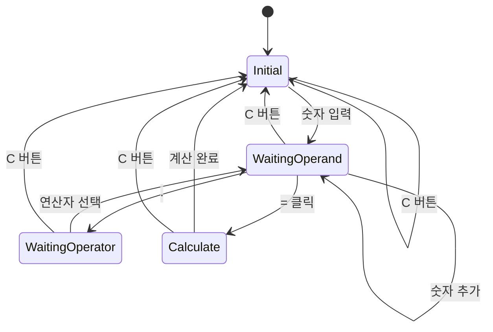
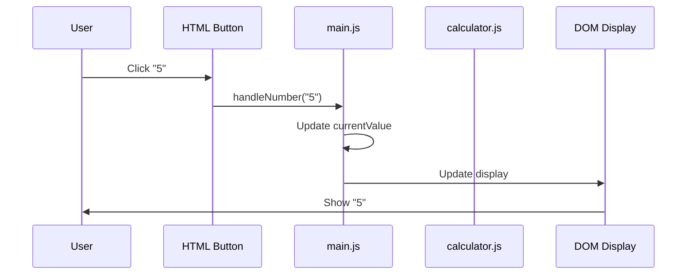
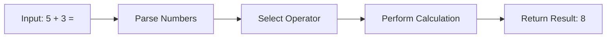

# Mermaid 다이어그램 추가 제안

## 개요
calculator-prototype의 design.md에 Mermaid 다이어그램을 추가하여 아키텍처, 상태 전이, 이벤트 흐름 등을 시각적으로 표현합니다.

## 문제 정의
현재 design.md는 ASCII 아트와 텍스트로 시스템을 설명하고 있습니다. Mermaid 다이어그램을 추가하면:
- 더 명확하고 전문적인 시각화 제공
- 시스템 아키텍처, 상태 머신, 이벤트 흐름을 한눈에 파악
- 마크다운 기반으로 버전 관리 용이
- 렌더링 시 깔끔한 다이어그램 표시

## 범위 (Scope)

### 추가될 다이어그램
1. **시스템 아키텍처 다이어그램** (Flowchart)
   - HTML UI → Event Listeners → Calculator Engine → Display Update의 흐름

2. **상태 머신 다이어그램** (State Diagram)
   - 계산기의 상태 전이: 숫자 입력, 연산자 선택, 결과 계산, 초기화

3. **이벤트 처리 흐름** (Sequence Diagram)
   - 버튼 클릭부터 디스플레이 업데이트까지의 상호작용

4. **데이터 흐름** (Graph)
   - 입력값 → 상태 객체 → 계산 로직 → 결과 출력

## 다이어그램 목록

### 1. 시스템 아키텍처 (Architecture Flow)
Mermaid Flowchart로 표현:

### 2. 상태 머신 (State Machine)
Mermaid State Diagram으로 표현:

### 3. 이벤트 흐름 (Sequence Diagram)
숫자 입력 시나리오:

### 4. 계산 흐름 (Calculation Flow)

## 파일 변경 사항

### design.md 수정
- ASCII 아트 대신 Mermaid 다이어그램으로 교체
- 각 섹션마다 대응되는 Mermaid 다이어그램 추가
- 기존 텍스트 설명은 유지 (상세 내용)

## 이점

1. **시각적 명확성**: 텍스트만으로 이해하기 어려운 아키텍처를 한눈에 파악
2. **유지보수성**: Mermaid 문법은 간단하고 마크다운 기반이므로 버전 관리 용이
3. **프로페셔널성**: 깔끔하게 렌더링되는 다이어그램
4. **확장성**: 향후 새로운 기능 추가 시 다이어그램도 쉽게 확장 가능

## 향후 고려사항

- Mermaid가 지원되지 않는 환경에서도 ASCII 아트 백업 제공 검토
- 다이어그램 복잡도 증가 시 더 세분화된 다이어그램 추가
