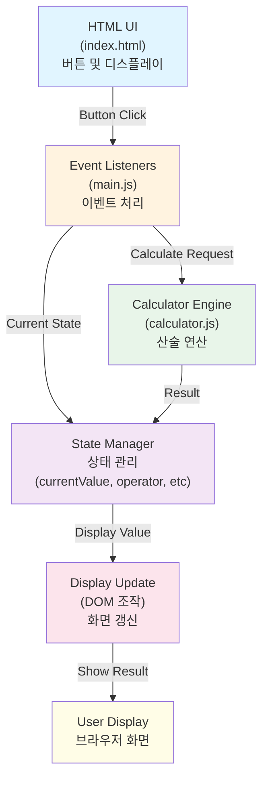
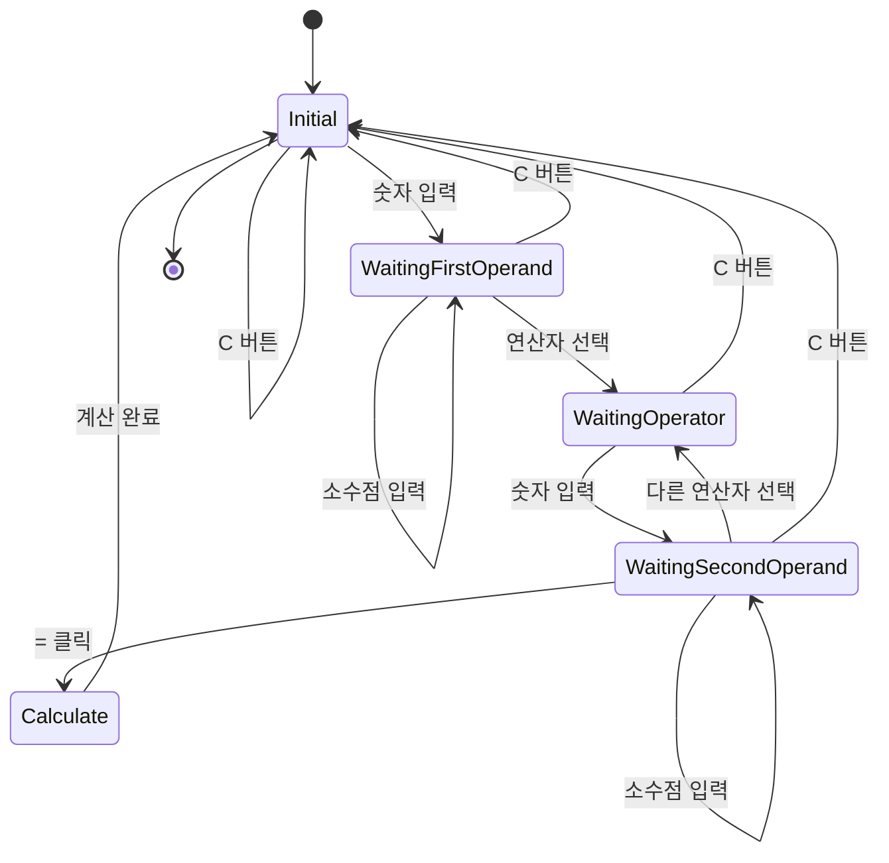
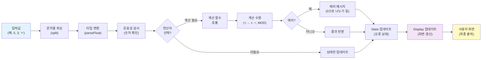
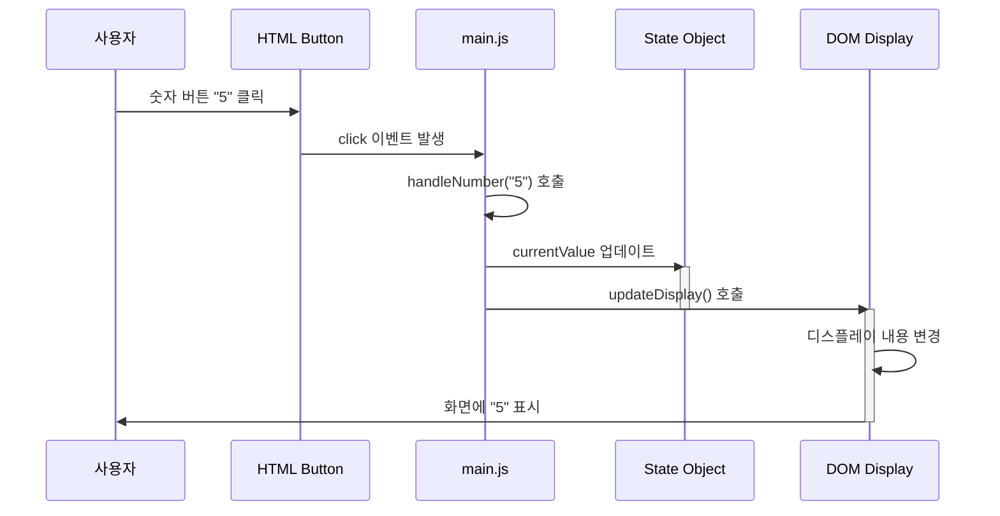
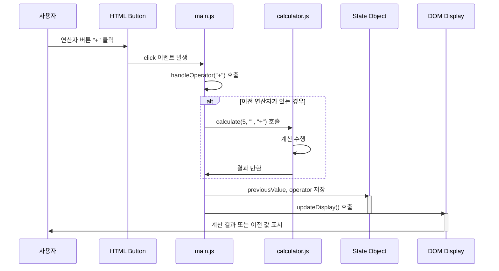
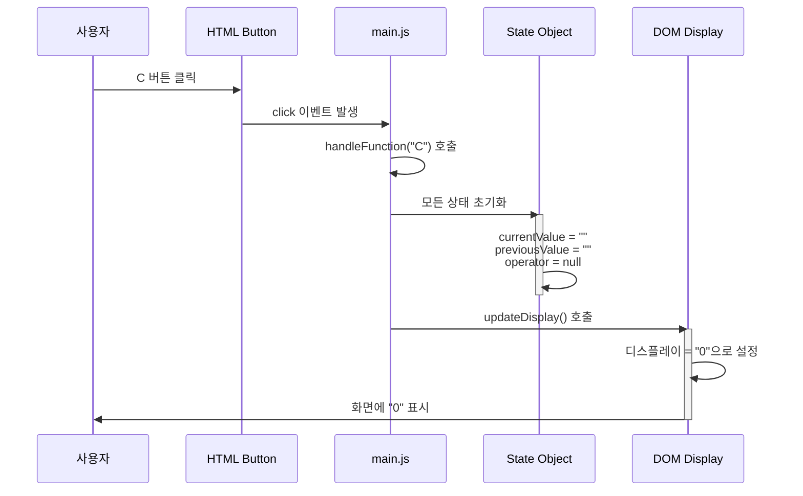

# 설계 문서 - 계산기 프로토타입

## 아키텍처 개요

### 시스템 구성



**데이터 흐름:**
- 사용자가 HTML 버튼을 클릭하면 JavaScript의 이벤트 리스너가 감지
- 현재 상태를 업데이트하거나 계산이 필요하면 Calculator Engine 호출
- 계산 결과는 상태에 저장되고 DOM을 통해 화면에 표시

## 상태 관리 설계

### 계산기 상태 객체
```javascript
{
  currentValue: string,        // 현재 입력값 (예: "123")
  previousValue: string,       // 저장된 값 (예: "5")
  operator: string,            // 현재 연산자 (예: "+")
  shouldResetDisplay: boolean  // 다음 입력 시 디스플레이 초기화 여부
}
```

### 상태 전이 (State Transitions)



**상태 설명:**

#### Initial (초기 상태)
- 계산기 시작 또는 이전 계산 완료 후
- 디스플레이: "0"

#### WaitingFirstOperand (첫 번째 피연산자 입력)
- 사용자가 첫 번째 숫자 입력 중
- 예: `5` 입력 → "5" 표시

#### WaitingOperator (연산자 대기)
- 첫 번째 숫자를 입력하고 연산자를 선택할 때까지
- 예: `5 +` → 연산자 선택 대기

#### WaitingSecondOperand (두 번째 피연산자 입력)
- 연산자 선택 후 두 번째 숫자 입력 중
- 예: `5 + 3` → "3" 표시

#### Calculate (계산 실행)
- 모든 피연산자와 연산자가 준비되어 계산 수행
- 결과를 Initial 상태로 저장

**상태 전이 상세 설명:**

#### 1. 숫자 버튼 클릭 → WaitingFirstOperand / WaitingSecondOperand
- 첫 숫자면 WaitingFirstOperand로 전이
- 두 번째 숫자면 WaitingSecondOperand로 전이
- 숫자 추가: 현재 숫자에 어펀드

#### 2. 연산자 버튼 클릭 (+, -, ×, ÷, MOD) → WaitingOperator
- 이전 연산자가 있으면 먼저 계산 수행
- 결과를 `previousValue`에 저장
- 새로운 연산자를 `operator`에 저장
- `shouldResetDisplay = true` (다음 숫자는 새로 시작)

#### 3. 결과(=) 버튼 클릭 → Calculate → Initial
- 저장된 연산자로 계산 수행
- 결과를 `currentValue`에 저장
- 디스플레이 업데이트
- `operator = null`
- 다음 계산을 위해 Initial로 복귀

#### 4. 초기화(C) 버튼 클릭 → Initial
- 모든 상태 초기화
- `currentValue = ""`, `previousValue = ""`, `operator = null`
- 디스플레이를 "0"으로 설정
- 어떤 상태에서든 즉시 Initial로 복귀 가능

## 계산 로직 설계

### 함수 분리
```javascript
// calculator.js
const Calculator = {
  add: (a, b) => a + b,
  subtract: (a, b) => a - b,
  multiply: (a, b) => a * b,
  divide: (a, b) => {
    if (b === 0) throw new Error("0으로 나눌 수 없습니다");
    return a / b;
  },
  modulo: (a, b) => {
    if (b === 0) throw new Error("0으로 나눌 수 없습니다");
    return a % b;
  }
};
```

### 계산 수행 함수
```javascript
function calculate(previousValue, currentValue, operator) {
  const a = parseFloat(previousValue);
  const b = parseFloat(currentValue);

  switch(operator) {
    case '+': return Calculator.add(a, b);
    case '-': return Calculator.subtract(a, b);
    case '×': return Calculator.multiply(a, b);
    case '÷': return Calculator.divide(a, b);
    case 'MOD': return Calculator.modulo(a, b);
    default: return b;
  }
}
```

## 데이터 흐름 설계

### 계산 데이터 흐름



**데이터 변환 단계:**

1. **입력값**: 사용자가 버튼 클릭 (숫자, 연산자, 소수점 등)
2. **파싱**: 입력값을 원하는 형식으로 추출
3. **타입 변환**: 문자열을 숫자로 변환 (parseFloat)
4. **유효성 검사**: 숫자가 맞는지, 소수점 중복 등 확인
5. **연산자 판단**: 계산이 필요한지 결정
6. **계산 수행**: 필요하면 Calculator 함수 호출
7. **에러 처리**: 계산 중 에러 처리 (0으로 나누기 등)
8. **상태 업데이트**: 결과를 State 객체에 저장
9. **화면 갱신**: DOM을 통해 사용자 화면에 표시

## 이벤트 처리 설계

### 이벤트 위임 (Event Delegation)
- 모든 버튼에 `data` 속성 추가
  - `data-type`: 'number' | 'operator' | 'function'
  - `data-value`: 버튼의 실제 값 (예: '+', '5', 'C')
- 단일 리스너로 모든 버튼 클릭 처리

### 이벤트 흐름 - 숫자 버튼 클릭



### 이벤트 흐름 - 연산자 버튼 클릭



### 이벤트 흐름 - 초기화(C) 버튼 클릭



### HTML 예시
```html
<button data-type="number" data-value="5">5</button>
<button data-type="operator" data-value="+">+</button>
<button data-type="function" data-value="C">C</button>
```

### 이벤트 핸들러
```javascript
document.getElementById('buttons-container').addEventListener('click', (e) => {
  const { type, value } = e.target.dataset;

  if (type === 'number') handleNumber(value);
  else if (type === 'operator') handleOperator(value);
  else if (type === 'function') handleFunction(value);
});
```

## 디스플레이 업데이트 전략

### 디스플레이 내용 결정
- 계산 중: `currentValue` 표시
- 계산 후: 계산 결과 표시
- 에러: 에러 메시지 표시

### 포맷팅
- 숫자 길이가 디스플레이 너비를 초과하는 경우 과학 표기법 또는 잘라내기 고려
- 소수점: 최대 표시 자릿수 설정 (예: 2자리)

## 오류 처리

### 0으로 나누기
- 에러 발생: "0으로 나눌 수 없습니다" 메시지 표시
- 디스플레이 색상 변경 (선택사항)
- C 버튼으로 복구 가능

### 소수점 다중 입력 방지
```javascript
function handleDecimal() {
  if (currentValue.includes('.')) return; // 무시
  currentValue += '.';
}
```

## CSS 구조

### Tailwind CSS 주요 클래스
```
- `calculator-container`: 주 컨테이너 (max-w-sm, mx-auto, p-4)
- `calculator-display`: 디스플레이 (bg-gray-800, text-white, text-right, text-2xl)
- `buttons-grid`: 그리드 레이아웃 (grid-cols-4, gap-2)
- `btn-number`: 숫자 버튼
- `btn-operator`: 연산자 버튼
- `btn-function`: 함수 버튼 (C, =)
```

또는 기본 CSS 사용:
```css
.calculator-container {
  width: 300px;
  margin: 20px auto;
  padding: 20px;
  border: 1px solid #ccc;
  border-radius: 8px;
}

.calculator-display {
  background: #333;
  color: #fff;
  font-size: 24px;
  text-align: right;
  padding: 10px;
  margin-bottom: 10px;
  border-radius: 4px;
  min-height: 50px;
}

.buttons-grid {
  display: grid;
  grid-template-columns: repeat(4, 1fr);
  gap: 5px;
}

button {
  padding: 15px;
  font-size: 16px;
  border: none;
  border-radius: 4px;
  cursor: pointer;
}

.btn-number, .btn-function {
  background: #f0f0f0;
  color: #333;
}

.btn-operator {
  background: #ff9500;
  color: #fff;
}

button:hover {
  opacity: 0.8;
}

button:active {
  transform: scale(0.95);
}
```

## 파일 구성

### index.html
- DOCTYPE, HTML 기본 구조
- Tailwind CSS 또는 CSS 링크
- 계산기 UI 요소
- JavaScript 파일 링크

### style.css
- 계산기 스타일 (Tailwind 또는 기본 CSS)
- 반응형 고려사항 (선택사항)

### calculator.js
- 순수 계산 로직
- 연산 함수들 (add, subtract, multiply, divide, modulo)
- 계산 함수

### main.js
- 상태 관리
- 이벤트 리스너 설정
- 디스플레이 업데이트 로직
- 초기화 함수

## 구현 단계

1. HTML 구조 작성 (1단계)
2. CSS 스타일링 (2단계)
3. 계산 로직 구현 (3-4단계)
4. 이벤트 처리 및 상태 관리 (5단계)
5. 디스플레이 업데이트 (6단계)
6. 테스트 및 검증 (7단계)

## 향후 확장성 고려

### 현재 설계로 쉽게 추가 가능한 기능
- 계산 이력: `calculate()` 함수 호출 후 결과를 배열에 저장
- 테마 설정: CSS 변수 또는 클래스 토글로 스타일 변경
- 키보드 입력: `keydown` 이벤트 리스너 추가
- 추가 연산: Calculator 객체에 함수 추가

### 고려사항
- 상태 저장 확장: 현재 구조는 계산 이력 추가에 적합
- 설정 저장: localStorage 활용 가능
- 성능: 현재 규모에서는 최적화 불필요
